# ***Entorno de desarrollo Java***

## **Instalacion del JDK**
>   *Lo primero sera descargar el jdk*
> 
>   [*Enlace de descarga del **JDK***](https://www.oracle.com/java/technologies/downloads/#jdk19-windows)
> ***
> 
>   - *Despues de descargarlo doble clic sobre el instalador **jdk-19_windows-x64_bin***
>   - *Se abrira la siguiente ventana Clic en **next***
>
> 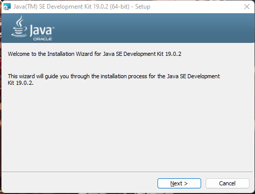
> ***
>
>   - *En esta parte se podra elegir la ubicacion de la instalacion, se puede cambiar o dejar la que da por defecto*
>   - ***Nota:** solo debemos fijarnos en la ubicacion en la que instale ya tendremos que acceder a ella*
>   - *Una vez decidida la ubicacion clic en **Next***
>   
> 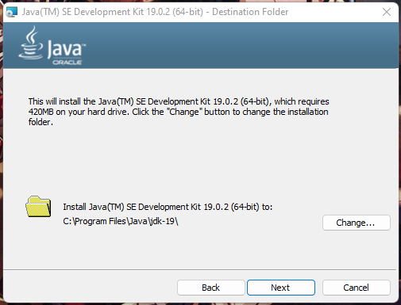
> ***
>   - *Solo queda esperar a que termine de instalarse*
> 
> 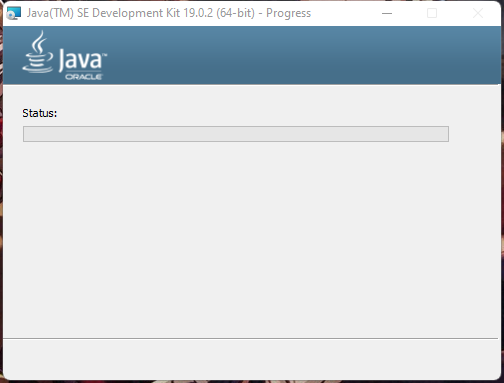
>
> ***
>
>   - *Terminada la instalaion clic en **Close***
> 
> 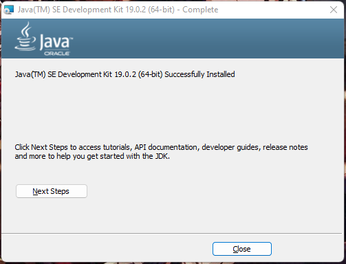
> ***
>
> ### **Configuracion de variable de entorno**
>
>   - *Para poder hacer uso del **JDK** se debe crear una variable de entorno en nuestro equipo.*
> 
>   **Pasos para la configuracion**
> 
>   - *Clic en el logo de Windows y luego seleccionar configuración*
> 
> 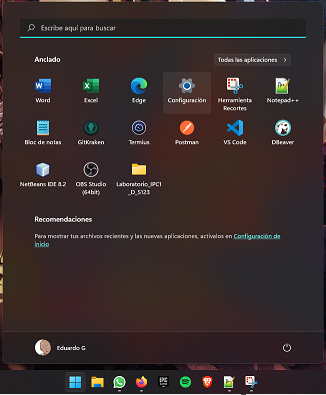
> ***
>   - *Luego buscar la opcion de **Sistema** y dar clic sobre ella*
>   - *Ingresar a Información(Windows 11) o Acerca de(Windows 10) esa la última opción del menú de **Sistema***
> 
> 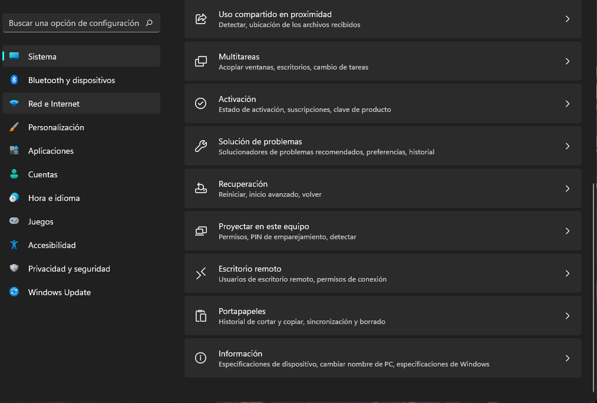
> ***
> 
>   - *Luego buscar la opcion **Configuracion avanzada del sistemas** y le dar clic sobre ella*
> 
> 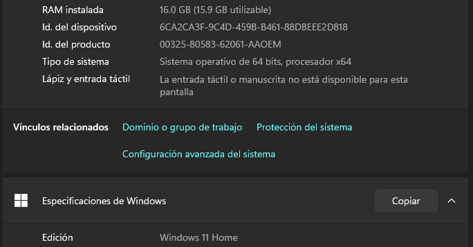
> ***
> 
>   - *Se abrira la siguiente ventana en la cual se le dara clic en la opcion de **Variables de entorno***
> 
> 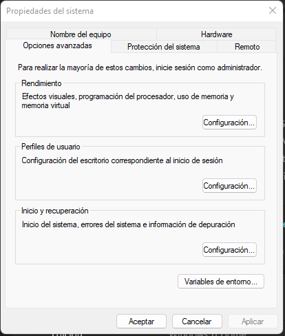
> ***
> 
>   - *Se abrira la siguiente ventana en **Variables de usuario para Nombre_usuario** dar clic en **Nuevo***
> 
> 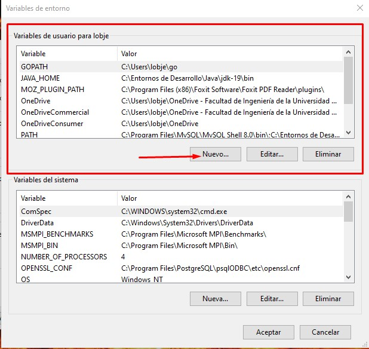
> ***
> 
>   - *En la ventana que se abre ponemos un nombre para la variable puede ser cualquiera,
usualmente se le pone **JAVA_HOME***
>   - *Luego en valor de la variable ponemos la ubicación donde se instaló el JDK por defecto en mi caso **C:\Progam files\Java\jdk-19** y agregamos al final de ubicación **\bin** luego clic en **Aceptar***
> 
> 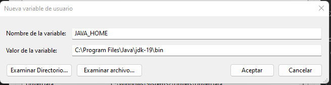
>
>   - *Como vemos ya aparece en la ventana anterior nuestra variable de entorno, clic en **Aceptar***
> 
> 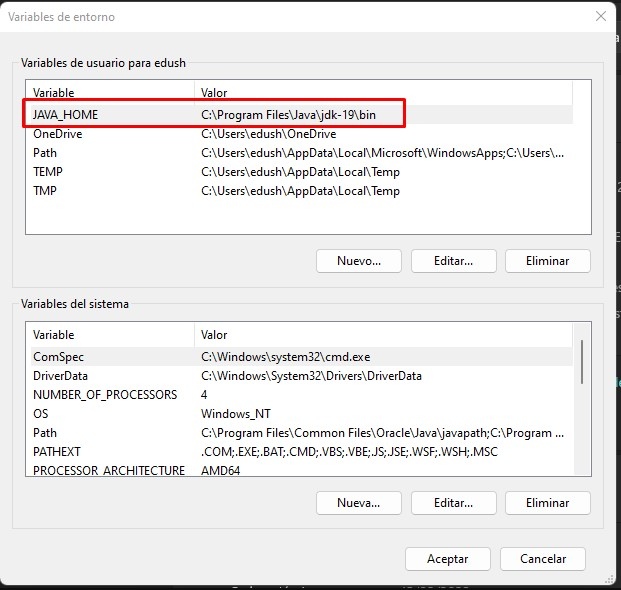
>
>   - *Nuevamente clic en **Aceptar** y reiniciamos el equipo*
> 
> 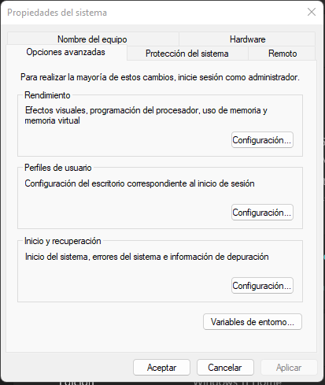
> ***
>   ### **Verificar la correcta instalacion y configuracion**
>   
>   *Pasos*
>   - *Abrimos una consola para ello clic en Inicio de Windows y tecleamos CMD y damos enter.*
>   - *Cuando abra la consola escribimos*
>   ```shell
>   javac -version
>   ``` 
>
>   - *Luego enter*
>   - *Después de que muestre el resultado escribimos*
>   ```shell
>   java -version
>   ```
>   - *Enter nuevamente*
>   - *en la consola tendria que verse un resultado igual al de la siguiente imagen*
> 
> 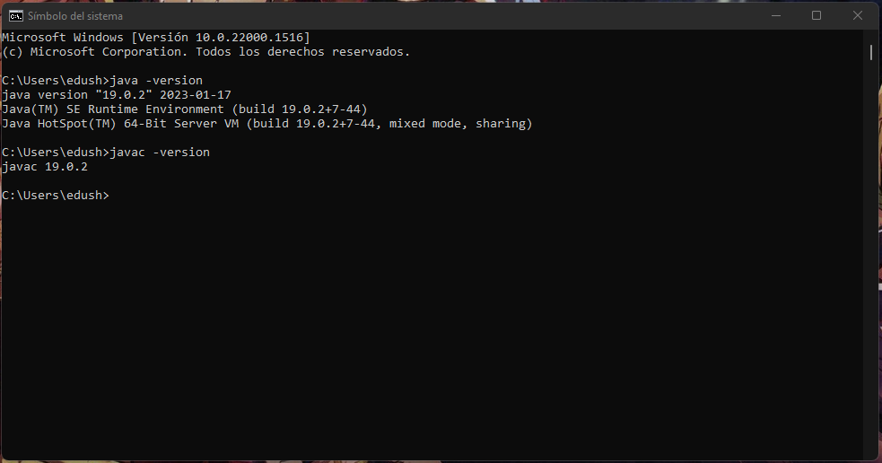
>
>
>
>
>
>
>
## **Instalacion de Netbeans**
>
>   *Lo primero sera descargar el Netbeans*
> 
>   [*Enlace de descarga de **Netbeans***](https://www.apache.org/dyn/closer.cgi/netbeans/netbeans-installers/16/Apache-NetBeans-16-bin-windows-x64.exe)
>   ***
>   - *Doble clic sobre el instalador **Apache-NetBeans-16-bin-windows-x64.exe***
>   - *Se abrira la siguiente ventana Clic en **next***
>
> 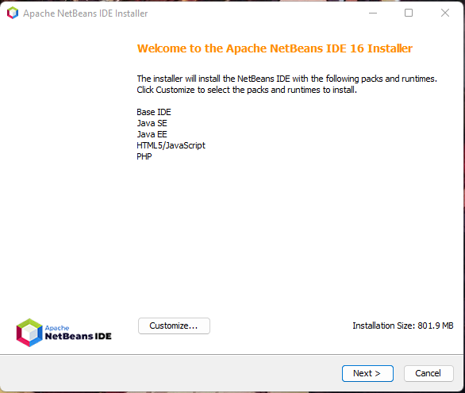
> ***
>   - *Aceptamos el acuerdo de la licencia y luego damos clic en **Next***
> 
> 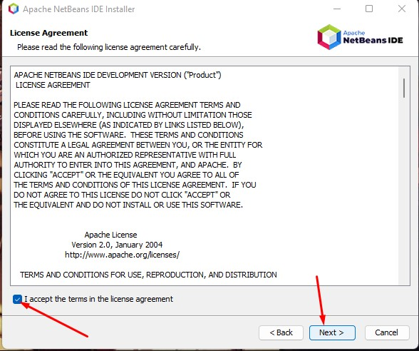
> ***
>   - *En la siguiente ventana escogemos donde se instalará **netbeans**, se recomienda dejar la que ya eligió el instalador, se puede cambiar con el botón Browse.*
>   - *Donde dice **JDK** se coloca la ubicación donde
se **instalo el JKD** si dejamos la ruta por defecto cuando instalamos JDK esta se cargara automáticamente*
>   - *Clic en **Next***
> 
> 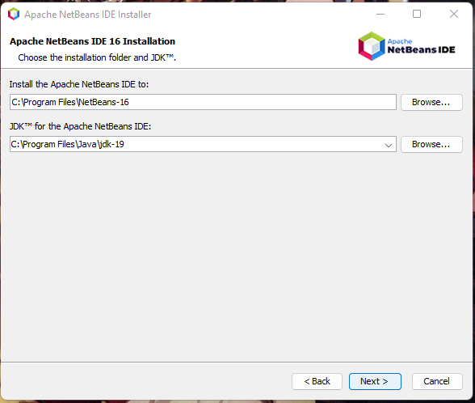
> ***
>   - *Elegir que el instalador verifique actualizaciones y después clic en **Install***
> 
> 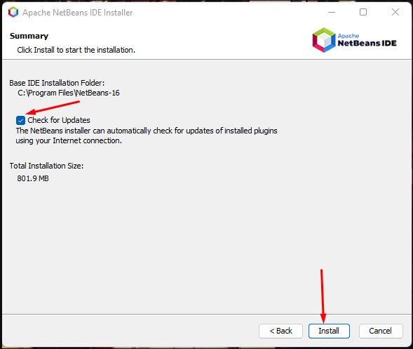
> ***
>   - *Esperara a que se instale*
> 
> 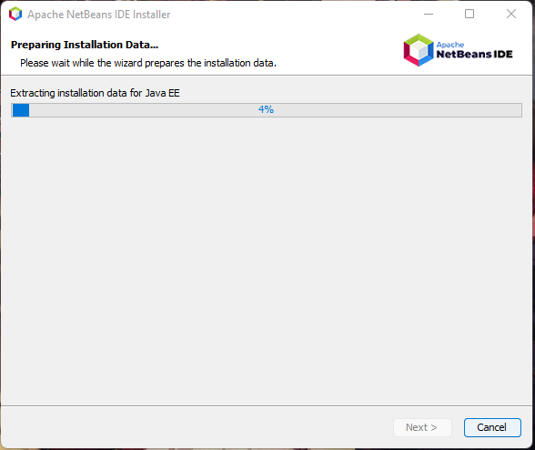
> ***
>
>   - *Una vez terminada la instalacion clic en **Finish***
> 
> 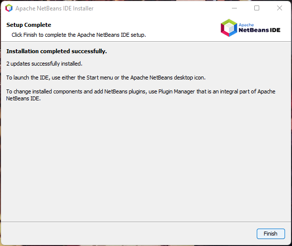
> ***
>
>   - *Luego doble clic sobre es **Acceso directo** en el escritorio y listo*
> 
> 
> ***
> ***