# ***Descarga, Instalacion y Configuracion de GitKraken***
> 
> *GitKraken es una herramienta que nos permite*
> ### **Descargar el instalador de acuerdo al sistema operativo a usar**
> 
> [*Enlace de descarga de Git Kraken*](https://www.gitkraken.com/download)
> 
>   ### **Realizar instalacion**
>   - *Para instalarlo solo daremos doble clic sobre el instalador* 
>   - *Esperar a que termine la instalacion y luego lo abrimos*
> 
> 
> ***
>   ### **Conneccion con Github**
>   *No aparecera una ventana para iniciar sesion seleccionamos la opcion de iniciar con Github*
> 
> 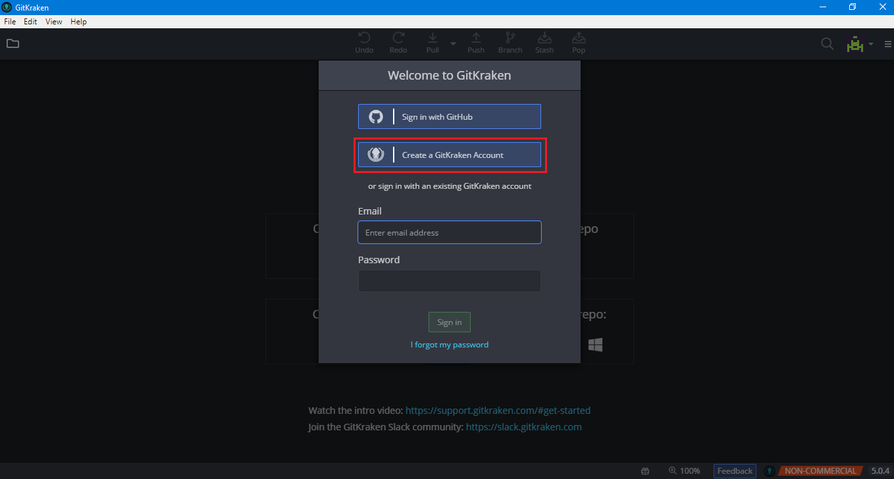
> 
>   *Nos redigira a una ventana similar a la siguiente en la cual ingresamos las credenciales de nuestra cuenta*
> 
> 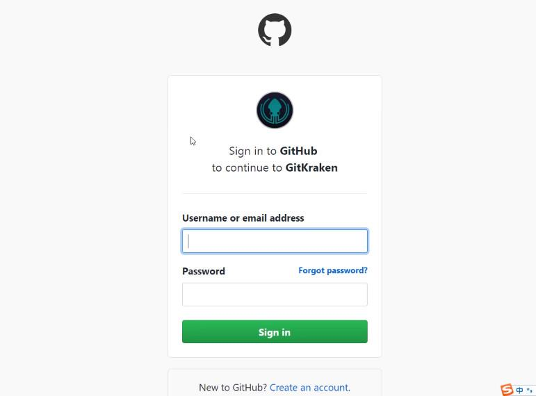
>   
>   ***
>   ***
>
> # ***Forma de clonar repositorio***
> 
>   *Despues de haber ingresado nuestras credenciales podremos ver las siguientes opciones en **GitKraken***
> 
> *Para clonar un repositorio clic en **Clone a repo***
> 
> 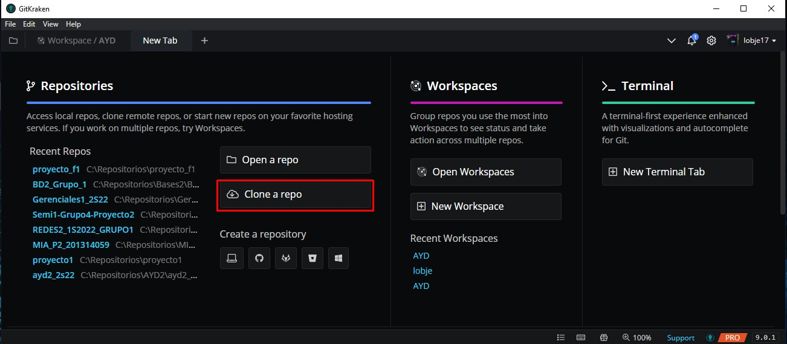
>
>   ***
> 
>   - *Aparecera la siguiete pantalla en la que seleccionaremos las opciones*
>       - *Clone*
>       - *Github.com*
>       - *La ubicacion en la que se almacenara*
>       - *Buscaremos el nombre del repositorio a clonar*
> 
> 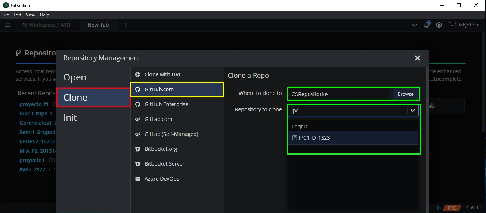
>
>   ***
>   - *Clic en **Clone the repo***
> 
> 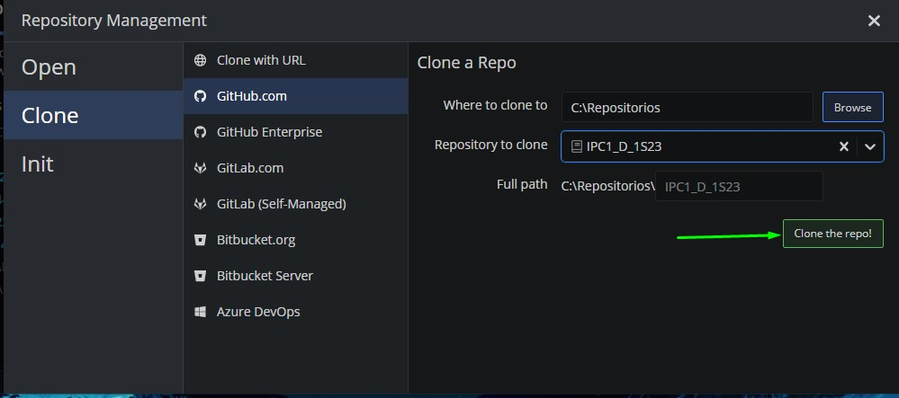
> 
>   ***
> 
>   - *Por ultimo **Open now** para mostra los cambio hecho en el repositorio*
> 
> 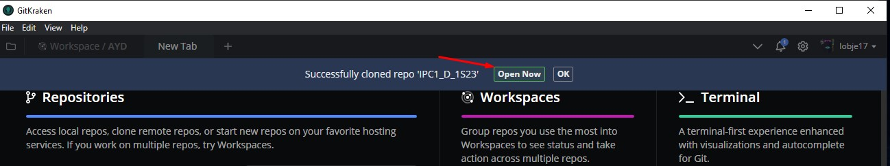
>   ***
>   - *Se mostraran todos los cambion realizados y agregados al repositorio remoto*
> 
> 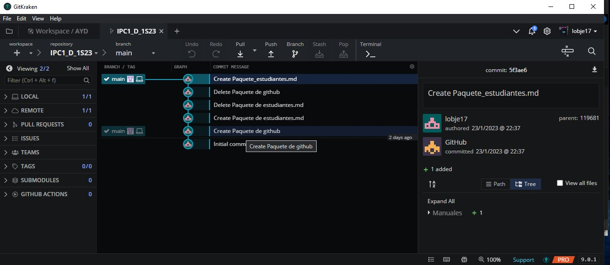
> 
> ***
> ***
> 
> # ***Formade agregar archivos o un Proyecto al repositorio***
> 
>   - *Ubicarse en la carpeta que se creo al clonar el repositorio*
> 
> 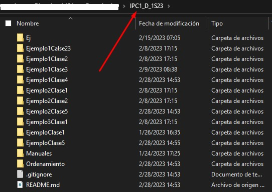
> ***
> 
>   - *Buscar la carpeta del proyecto o archivos a agregar al repositorio*
> 
> 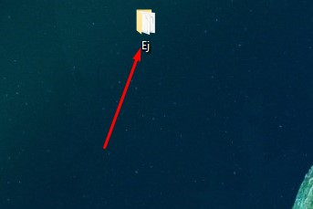
>
>   - *Copiar la carpeta o archivos a la carpeta del repositorio*
> 
> 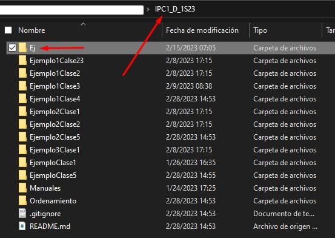
> 
> ***
> ***
> 
> # ***Forma de realizar un commit***
> 
>   - *Los commit nos permitiran guardar todos los cambios en el repositorio*
>   ***
> 
>   - *En **Unstaged Files** se mostraran todos los archivos modificados*
>   - *Se tiene la opcion de agregar todos los archivos al commit con **Stage all changes***
> 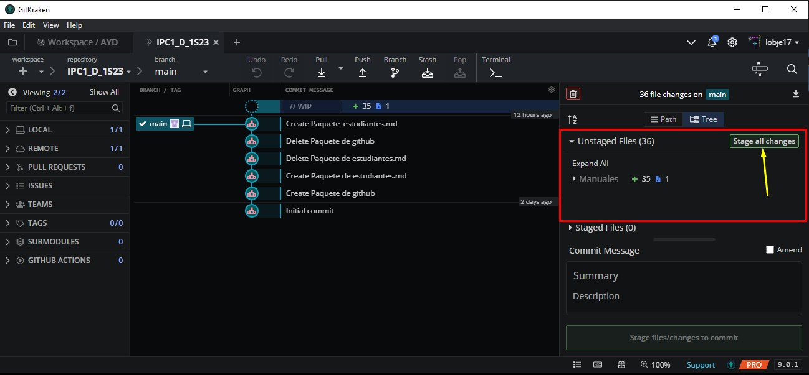
> 
>   ***
>   
>   - *Se tiene la opcion de agregar una carpeta dando clic derecho sobre ella y seleccionar **Stage folder***
> 
> 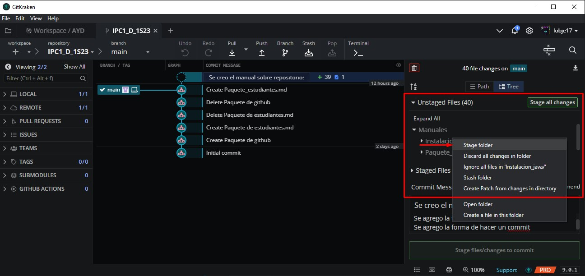
> 
> ***
>   - *O bien la opcion de agregar solo algunos archivos, colocando el cursor sobre el archivo y dando clic en **Stage file***
> 
> 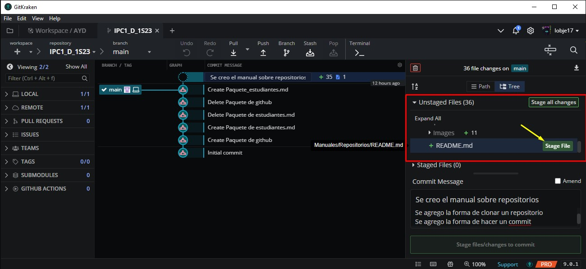
>   ***
> 
>   - *En **Staged Files** se mostraran todos los archivos que se guardaran en el commit*
>   - *Se tiene la opcion de remover todos los archivos del commit con **Unstage all changes***
> 
> 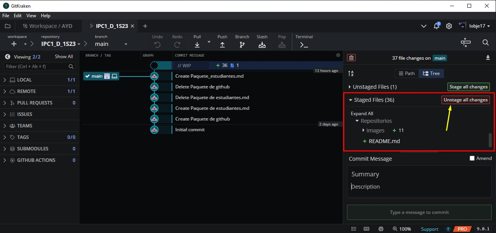
> 
>   ***
> 
>   - *Se tiene la opcion de remover una carpeta dando clic derecho sobre ella y seleccionar **Unstage folder***
> 
> 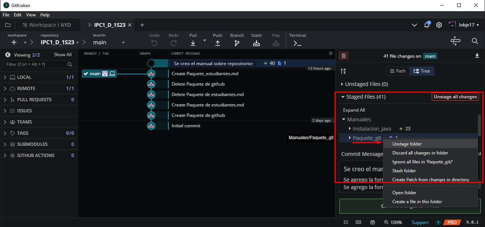
> 
>   ***
> 
>   - *O bien la opcion de remover solo algunos archivos, colocando el cursor sobre el archivo y dando clic en **Unstage file***
> 
> 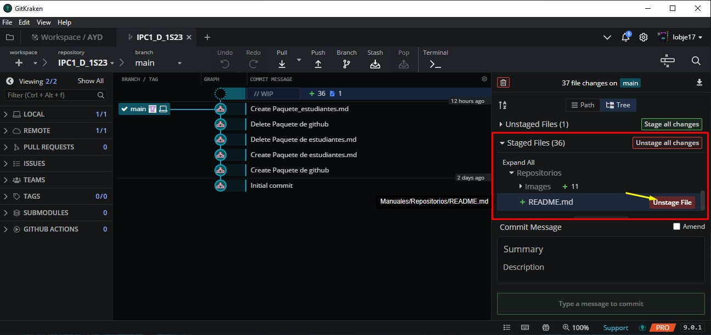
> 
>   ***
>   - *Para realizar el commit es necesario **Summary** es un resumen de lo que se realizo*
>   - *La descripcion es opcional, pero en ella podemos ampliar sobre los diversos cambios realizados*
> 
> 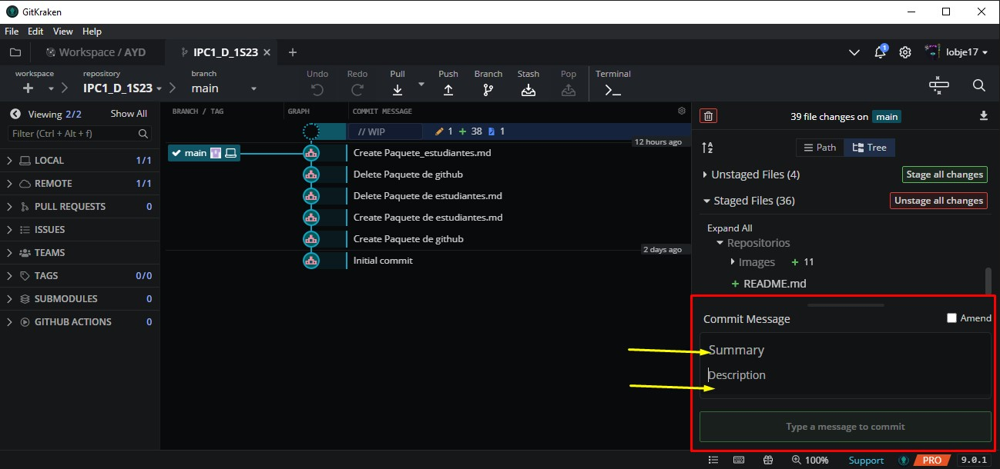
> 
> ***
> 
>   - *Por ultimo clic en Commit change*
>   - *Todos los cambios se almacenaran en el **repositorio local***
> 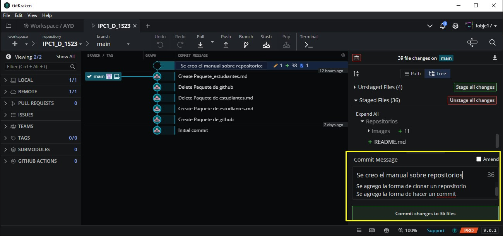
> 
> ***
> ***
> 
> # ***Subir cambios al repositorio remoto***
>   
>   - *Para realizar esto lo unico que debemos hacer es dar clic en **Push***
> 
> 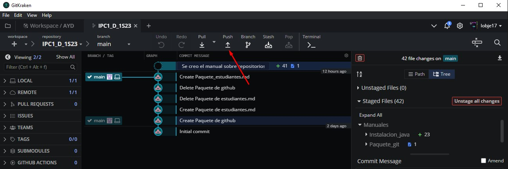
> 
>   ***
>   ***
